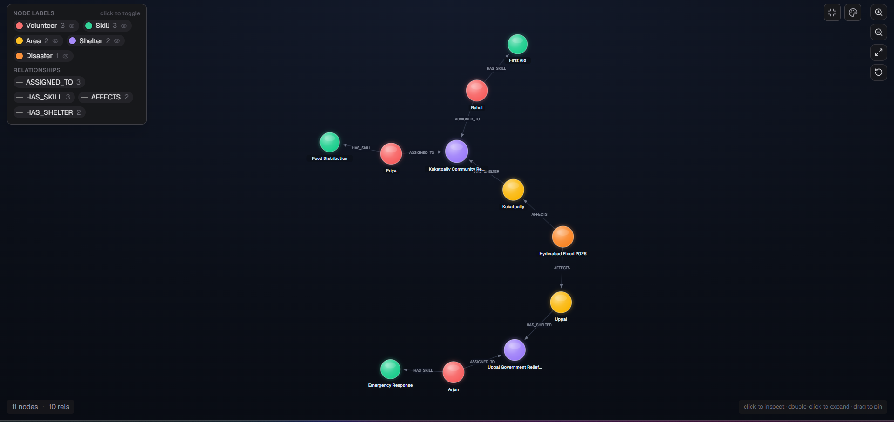
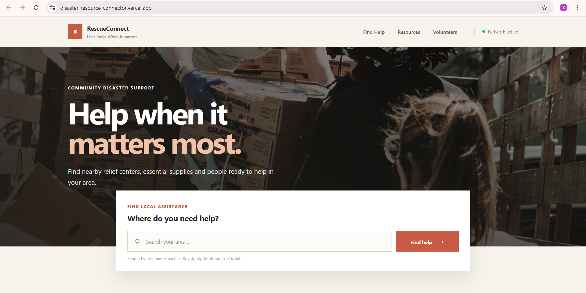
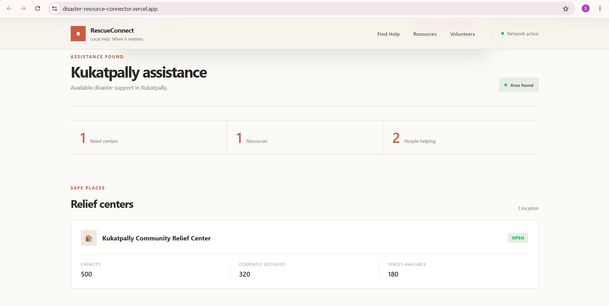
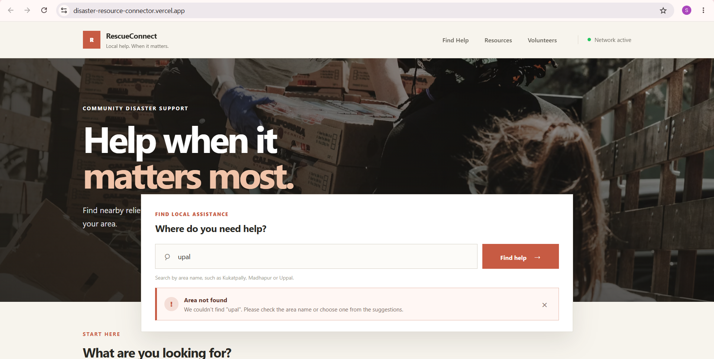

# DisasterResourceConnector (RescueConnect)

A community disaster-relief coordination app that helps people affected by a
disaster find the nearest open shelter, see what resources (food, water,
medical supplies) are actually available there right now, and see which
volunteers with relevant skills are on-site — all in one search.

**Live demo:** https://disaster-resource-connector.vercel.app/
**Backend API:** https://disasterresourceconnector-production.up.railway.app
**Screen recording:** https://drive.google.com/file/d/1beWJh7HuH2pHO5OtduvehDurx0vlkaOH/view?usp=sharing

---

## Why a graph database?

Disaster response data is fundamentally about **relationships**, not
isolated records: a disaster *affects* areas, an area *has* shelters, a
shelter *is supported by* organizations, organizations *provide* resources
that are *available at* shelters, and volunteers *with specific skills*
are *assigned to* those same shelters.

The questions that actually matter in a real emergency are multi-hop by
nature — "which shelters near this disaster still have medical supplies
AND a volunteer who knows first aid?" In a relational database, this means
joining 5+ tables (disasters → areas → shelters → resources/volunteers →
skills) with careful foreign key management, and the join complexity grows
every time a new relationship type is added. In a graph model, this is a
single, readable Cypher traversal that mirrors how the domain actually
works — and it stays cheap to query even as the data grows, since graph
traversal doesn't suffer the same join-explosion relational databases do.

It also makes the model naturally extensible: adding a new relationship
(e.g. `Area -[:NEEDS]-> ResourceType`) doesn't require a schema migration
or a new join table, just a new edge type.

## Data model

```
(:Disaster)-[:AFFECTS]->(:Area)-[:HAS_SHELTER]->(:Shelter)
(:Shelter)-[:SUPPORTED_BY]->(:Organization)
(:Organization)-[:PROVIDES {quantity, providedDate, status}]->(:Resource)
(:Resource)-[:AVAILABLE_AT {quantity, lastUpdated, status}]->(:Shelter)
(:Organization)-[:HAS_VOLUNTEER]->(:Volunteer)
(:Volunteer)-[:ASSIGNED_TO {role, assignedDate, status}]->(:Shelter)
(:Volunteer)-[:HAS_SKILL {proficiency}]->(:Skill)
```

**Nodes:** `Disaster`, `Area`, `Shelter`, `Organization`, `Resource`,
`Volunteer`, `Skill`

**Relationships carry data too** — e.g. `AVAILABLE_AT` stores the
*current* quantity of a resource at a specific shelter (separate from the
resource's total quantity), and `ASSIGNED_TO` stores a volunteer's role
and assignment date. This is something a relational join table can do,
but awkwardly — here it's a first-class part of the model.



## Tech stack

- **Backend:** Java, Spring Boot, official Neo4j Java driver (Bolt
  protocol, compatible with CognoDB)
- **Database:** CognoDB Cloud (managed graph database)
- **Frontend:** Static HTML/CSS/JavaScript (no framework), calling the
  backend REST API
- **Hosting:** Backend on Railway, frontend on Vercel

## Setup and run instructions

### 1. Create a CognoDB instance

1. Sign up at [console.cognodb.com](https://console.cognodb.com/signup)
   (free tier, no credit card required).
2. Create a free (c0) instance and pick a region — provisions in under a
   minute.
3. Save your connection URI (`bolt+s://<instance-id>.databases.cognodb.cloud`)
   and the generated password for user `cognodb`. The password is shown
   only once.

### 2. Configure environment variables

Create a `.env` file (or set environment variables directly) with:

```
COGNODB_URI=bolt+s://<instance-id>.databases.cognodb.cloud
COGNODB_USER=cognodb
COGNODB_PASSWORD=<your-password>
```

These are read by the Spring Boot app at startup and are **never
committed to the repository**.

### 3. Seed the database

Open the CognoDB console's query editor, paste the full contents of
[`disaster-resource-connector/src/main/resources/seed.cypher`](./disaster-resource-connector/src/main/resources/seed.cypher),
and run it. This creates the sample disaster, areas, shelters,
organizations, resources, volunteers, and skills used by the demo.

### 4. Run the backend

```bash
cd disaster-resource-connector
./mvnw spring-boot:run
```

The API will start on `http://localhost:8080`.

### 5. Run the frontend

The frontend is plain static HTML/CSS/JS in the `frontend/` folder. Open
`frontend/index.html` directly, or serve it with any static file server.
By default it points at the deployed Railway backend
(`API_BASE_URL` in `script.js`) — change this to `http://localhost:8080`
if you want to test against your local backend instead.

## Main queries explained

### 1. Multi-hop traversal — full picture for an area

Finds the disaster, area, shelter, and every volunteer with a skill
assigned there, in a single traversal (4 hops):

```cypher
MATCH (d:Disaster {id: "D001"})
      -[:AFFECTS]->(a:Area)
      -[:HAS_SHELTER]->(s:Shelter)
      <-[:ASSIGNED_TO]-(v:Volunteer)
      -[:HAS_SKILL]->(sk:Skill)
RETURN d.name AS disaster, a.name AS area, s.name AS shelter,
       v.name AS volunteer, sk.name AS skill;
```

### 2. The query a relational database would find awkward

Finds shelters in a specific area that currently have *either* an
available resource *or* an available medical volunteer — combining two
independent optional branches of the graph and aggregating both into one
result per shelter. In SQL this needs two separate LEFT JOINs plus
careful `GROUP BY`/aggregation handling to avoid row duplication:

```cypher
MATCH (d:Disaster {id: "D001"})
      -[:AFFECTS]->(a:Area {id: "A001"})
      -[:HAS_SHELTER]->(s:Shelter)
OPTIONAL MATCH (s)<-[av:AVAILABLE_AT]-(r:Resource)
OPTIONAL MATCH (s)<-[:ASSIGNED_TO]-(v:Volunteer)-[:HAS_SKILL]->(sk:Skill)
WHERE (r.status = "AVAILABLE" AND av.quantity > 0)
   OR (sk.category = "MEDICAL" AND v.availability = "AVAILABLE" AND v.status = "ACTIVE")
RETURN d.name AS disaster, a.name AS area, s.name AS shelter,
       collect(DISTINCT {resource: r.name, quantity: av.quantity, unit: r.unit}) AS availableResources,
       collect(DISTINCT {volunteer: v.name, skill: sk.name}) AS availableVolunteers;
```

### 3. Real-time resource availability by area

Used by the app's main search — shows what's actually available (not
just what was originally provided) at each shelter in an area:

```cypher
MATCH (d:Disaster {id: "D001"})
      -[:AFFECTS]->(a:Area)
      -[:HAS_SHELTER]->(s:Shelter)
      <-[av:AVAILABLE_AT]-(r:Resource)
WHERE av.quantity > 0
RETURN a.name AS area, s.name AS shelter, r.name AS resource,
       r.category AS category, av.quantity AS availableQuantity,
       r.unit AS unit, av.status AS status
ORDER BY a.name, r.name;
```

## Error handling

The frontend detects when the backend is unreachable (network failure or
non-2xx response) and shows a clear "Backend connection problem" message
instead of a blank or broken screen. Searches for areas that don't exist
show an explicit "Area not found" message with guidance, rather than
failing silently.

## Screenshots

**Homepage**


**Search results for an area**


**Empty state — area not found**


**CognoDB graph view**

